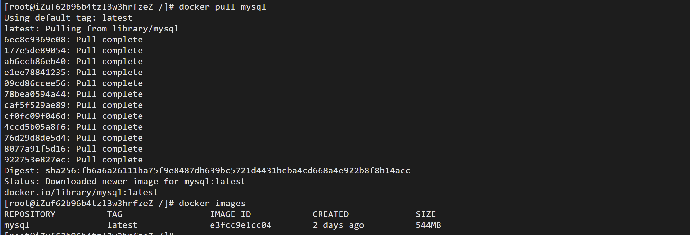
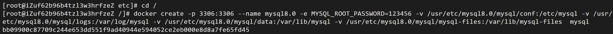
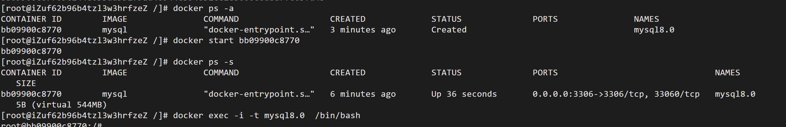
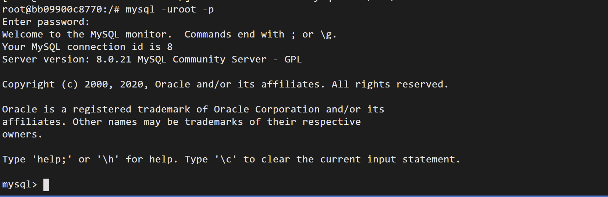
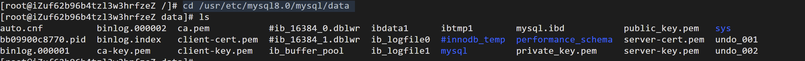

##### 拉取最新镜像
```
docker pull mysql #拉取最新镜像
docker images #查看镜像
```


##### 创建挂载路径
```
#创建挂载路径
mkdir -p /usr/etc/mysql8.0/mysql/conf /usr/etc/mysql8.0/mysql/logs /usr/etc/mysql8.0/mysql/data /usr/etc/mysql8.0/mysql/mysql-files
```


##### 创建MySql8.0容器
```
docker create -p 3306:3306 --name mysql8.0 -e MYSQL_ROOT_PASSWORD=123456 -v /usr/etc/mysql8.0/mysql/conf:/etc/mysql -v /usr/etc/mysql8.0/mysql/logs:/var/log/mysql -v /usr/etc/mysql8.0/mysql/data:/var/lib/mysql -v /usr/etc/mysql8.0/mysql/mysql-files:/var/lib/mysql-files  mysql

#/usr/etc/mysql8.0/mysql/conf:/etc/mysql 将容器中/etc/mysql文件挂载在主机/usr/etc/mysql8.0/mysql/conf路径
#-p 3306:3306 端口映射
#-e MYSQL_ROOT_PASSWORD=123456 root账号密码123456
#--name mysql8.0 容器别名
#mysql镜像名称
```


##### 查看当前存在的容器并进入容器
```
#查看当前存在的容器
docker ps -a
#启动容器
docker start bb09900c8770 
#查看执行中的容器
docker ps -s  
#进入执行中的容器
docker exec -i -t mysql8.0  /bin/bash
```


##### 测试
```
#测试
mysql -uroot -p
```


##### 查看主机中挂载路径中的内容
```
#查看主机中挂载路径中的内容
cd /usr/etc/mysql8.0/mysql/data
ls
```

