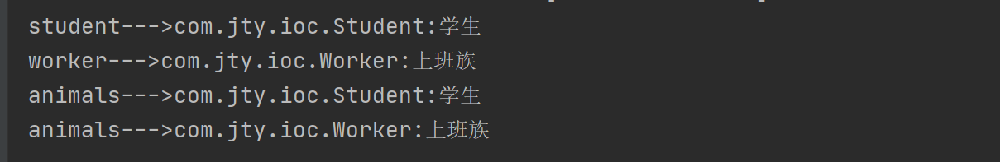
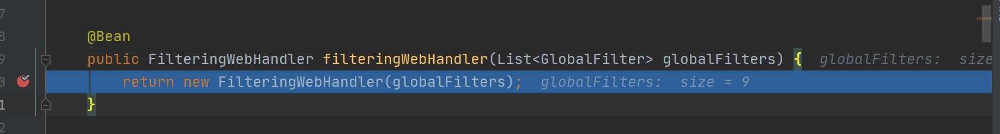

#### 目录

##### @Bean标注在有参方法上可以获取参数的Bean，若为List集合 则获取继承或实现该类的所有已注入的Bean，验证如下

`Person.java`
```
public interface Person {
    /**
     * 信息
     * @return String
     */
     String inf();
}
```

`Student.java`
```
public class Student implements Person {
    private String work;
    public Student(String work){
        this.work=this.getClass().getName()+":"+work;
    }
    @Override
    public String inf() {
        return this.work;
    }
}
```

`Worker.java`
```
public class Worker implements Person {
    private String work;
    public Worker(String work){
        this.work=this.getClass().getName()+":"+work;
    }
    @Override
    public String inf() {
        return this.work;
    }
}
```

`AnimalAutoConfiguration`
```
@Configuration
public class AnimalAutoConfiguration {
    @Bean
    public Student getUser(){
        return new Student("学生");
    }
    @Bean
    public Worker getWorker(){
        return new Worker("上班族");
    }
    /**
     * 此处将把所有实现Persion接口的类的Bean注入list集合中
     */
    @Bean
    public List<Person> getAnimals(List<Person> list){
        return list;
    }
}
```

`Test.java`
```
@RestController
public class Test {
    @Autowired
    private  Student student;
    @Autowired
    private  Worker worker;
    @Autowired
    private  List<Person> animals;

    @GetMapping(value = "/get/info")
    public  void test(){
        System.out.println("student--->"+student.inf());;
        System.out.println("worker--->"+worker.inf());;
        for (Person person:animals) {
            System.out.println("animals--->"+person.inf());;

        }
    }
}
```



注：getway网关中使用该方式将所有全局过滤器集合作为参数（单个实现类也需要注入，才能获取到集合）

