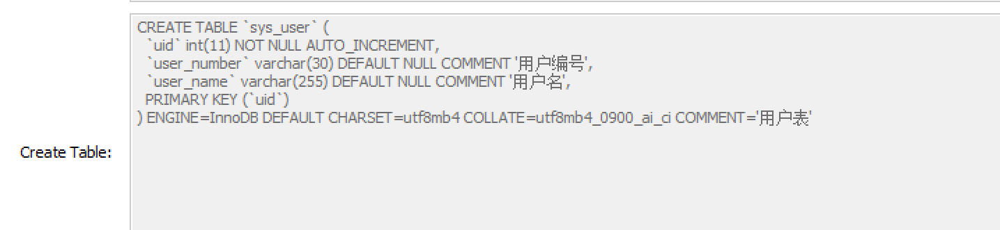
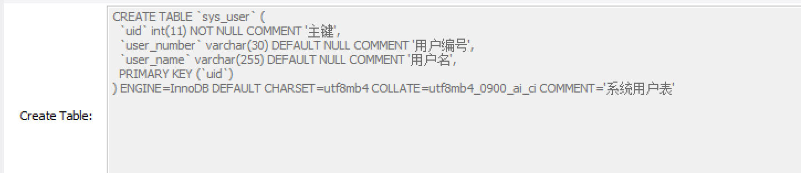

### 一、查看建表SQL
```
desc sys_user;
```
### 二、添加注释、查看注释
#### 1、建表时添加
```
create table sys_user(
uid int primary key auto_increment,
user_number varchar(30) comment '用户编号',
user_name varchar(255) comment '用户名'
) comment '用户表';
show create table sys_user;
```

#### 2、建表后添加
```
alter table sys_user modify uid int comment '主键';
alter table sys_user comment '用户表';
show create table sys_user;
```


```
#查看字段上的注释
show  full  columns  from  sys_user;
```
